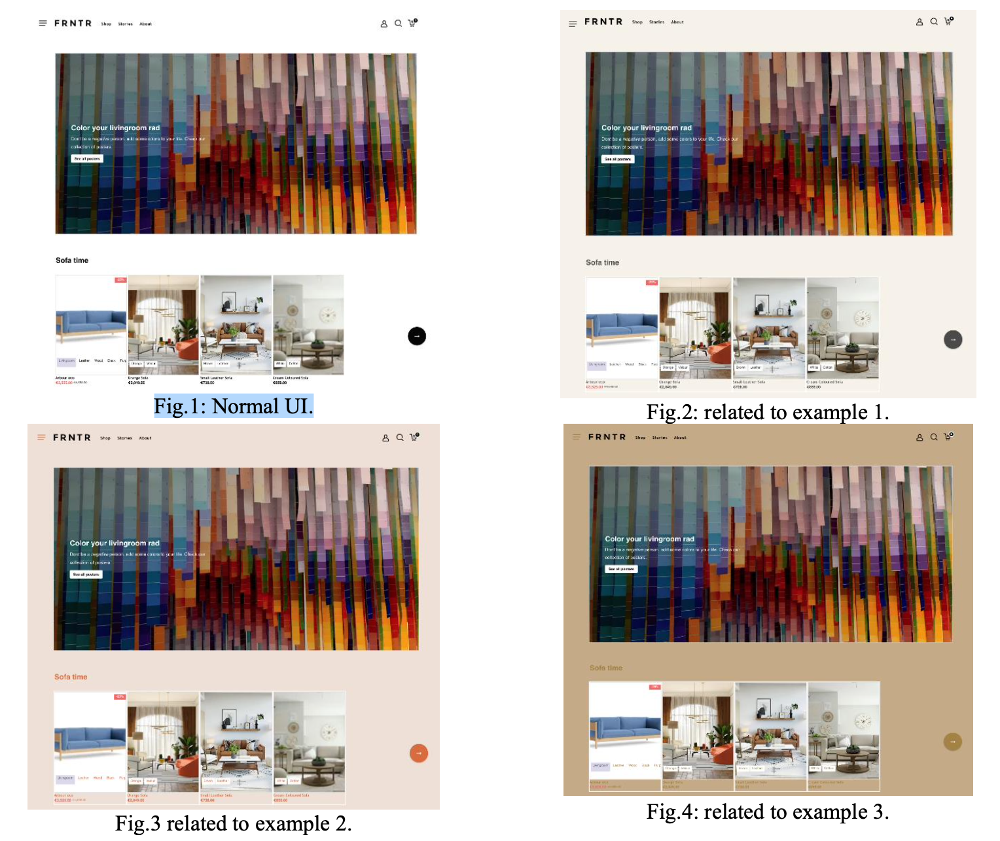

# AI-Powered Front-End Development Applied on Crystallize Next.js Boilerplate

# Introduction

Crystallize helps businesses create customized eCommerce experiences. By
integrating AI into the platform, we can unlock innovative solutions to enhance
its features and stay ahead of industry trends. With AI being such a popular
topic, there are many ways to leverage its power within Crystallize. For
example, AI could enhance the UI/UX templates by adapting to each customer’s
unique interests and preferences, making the experience more personalized.

To demonstrate this concept, I utilized Crystallize’s **Next.js boilerplate**,
applied traditional and generative AI to analyze user interactions with images,
and made minor modifications to the homepage’s UI. In this small example, I
specifically focused on the following elements:

- Main Background Color
- Text Main Color
- Text Sub Color
- Box Background Color

While this example is a simple initial demonstration, it effectively showcases
the potential of this idea. A full-scale implementation would require further
focus, study, and effort. With continued development, this concept could be
scaled to provide a truly customized and engaging experience for each user.

## Determining a Customer’s Personalized Interests

To personalize the user experience, we can utilize various AI-powered methods to
determine a customer’s preferences. One approach is to analyze the customer’s
interaction history on the website and identify patterns in their choices.
Alternatively, we could engage users in an interactive experience, such as a
brief game where they select images from a set. By analyzing their choices, we
can infer their preferences for colors, shapes, and design themes (e.g.,
classic, modern, dark, or light) and predict their interests to adjust the UI
accordingly, creating a more personalized experience.

## Examples of Personalized UI Adjustments

### Example 1 (Fig.2):

- **User Interaction**: Clicks on images of a small leather sofa and a
  creamy-colored sofa.
- **Generative AI Analysis**: Predicts interest in the colors Alabaster, Dark
  Gray, Dove Gray, and Sage Green.

  **Resulting UI:**

  - Main Background: `#F5F1E9` (Alabaster)
  - Text Main: `#4A4A4A` (Dark Gray)
  - Text Sub: `#7A7A7A` (Dove Gray)
  - Box Background: `#B5C1A3` (Sage Green)

### Example 2 (Fig.3):

- **User Interaction**: Clicks on images of an orange sofa and a creamy-colored
  sofa.
- **Generative AI Analysis**: Predicts interest in the colors Linen, Copper, and
  Alabaster.

  **Resulting UI:**

  - Main Background: `#EDDFD5` (Linen)
  - Text Main: `#D96C3F` (Copper)
  - Text Sub: `#F5F1E9` (Alabaster)
  - Box Background: `#F5F1E9` (Alabaster)

### Example 3 (Fig.4):

- **User Interaction**: Clicks on images of a small leather sofa and an orange
  sofa.
- **Traditional AI Analysis**: Predicts interest in the colors Camel, Bronze,
  Pale Mauve, and Taupe.

  **Resulting UI:**

  - Main Background: `#C5A987` (Camel)
  - Text Main: `#A38144` (Bronze)
  - Text Sub: `#DED3D7` (Pale Mauve)
  - Box Background: `#6D5653` (Taupe)

## Modified or Created Components

- Created an `ImageClickedContext.js` component in the `lib` directory.
- Created an AI folder under the `src` directory and added the related
  components there, aiming to keep the new parts organized within a single
  folder as much as possible.
- Made modifications to the entry component (`index.js`) within the `pages`
  directory.
- Leveraged generative AI to navigate Crystallize's **Next.js boilerplate**,
  addressing implementation challenges and debugging more efficiently.
